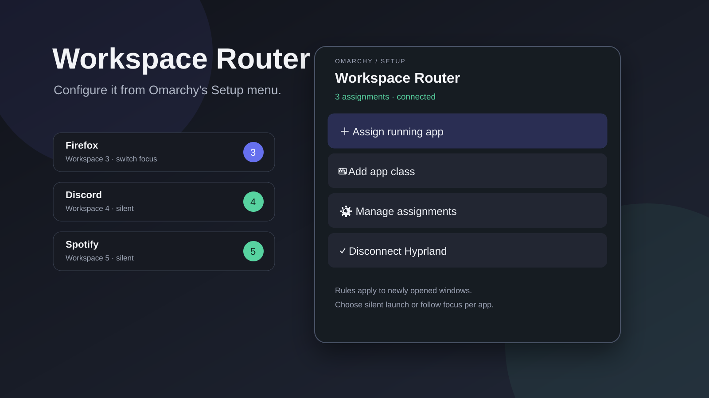

# Workspace Router for Omarchy



Put apps where they belong—automatically.

Workspace Router is an Omarchy menu plugin for assigning application windows
to Hyprland workspaces. Every assignment also decides whether a new window
opens quietly in the background or takes you to its workspace.

## Features

- Pick from currently running applications; no window-class detective work.
- Assign any app to workspace 1–10.
- Choose **Open silently** or **Switch to its workspace** per app.
- Add an exact window class manually for apps that are not running.
- Change or remove assignments from the menu.
- Stay out of the taskbar: the configuration UI lives under Omarchy's Setup menu.
- Generate small, readable Hyprland Lua rules matched by `initial_class`.
- Back up `hyprland.lua` before adding or removing the integration line.
- Keep assignments in a plain JSON file that is easy to inspect and back up.

## Requirements

- Omarchy Quattro 4.0.3 or newer.
- Hyprland using Omarchy's Lua configuration.
- Commands included with Omarchy: `omarchy`, `hyprctl`, `jq`, and `luac`.

No network access, daemon, account, elevated privileges, or third-party service
is required.

## Install

```sh
omarchy plugin add https://github.com/Loedn/omarchy-workspace-router.git --enable
~/.config/omarchy/plugins/io.github.loedn.workspace-router/bin/omarchy-workspace-apps menu-install
```

The second command explicitly adds **Workspace Router** to Omarchy's **Setup**
menu. It does not add anything to the taskbar. The menu registration is kept
separate because Omarchy's plugin installer deliberately does not run install
hooks or change user configuration.

### First-run integration

Open **Omarchy menu → Setup → Workspace Router** and choose **Connect
Hyprland**. Workspace Router shows a confirmation before it changes anything.
Once approved, it:

1. creates a timestamped backup beside `~/.config/hypr/hyprland.lua`;
2. adds a marked `require("hypr.workspace-apps")` integration line;
3. creates `workspace-apps.json` and the generated `workspace-apps.lua`;
4. reloads Hyprland and reports configuration errors.

Choosing **Assign running app**, **Add app class**, or **Manage assignments**
also offers this connection step if it has not been completed yet.

## Use

Open **Omarchy menu → Setup → Workspace Router** and choose one of the
following:

### Assign running app

1. Select a currently open application.
2. Select workspace 1–10.
3. Choose its launch behavior:
   - **Open silently** sends the window to its workspace without changing your
     current workspace.
   - **Switch to its workspace** follows the newly opened window.

### Add app class

Enter an exact Hyprland window class, then choose its workspace and launch
behavior. Find classes with `hyprctl clients` when needed.

### Manage assignments

Select a saved application to change its workspace, change its launch behavior,
or remove the assignment.

Rules apply when a window is created. They do not move existing windows, and
you can still move an assigned window manually afterward.

## Data and generated configuration

Workspace Router owns only these files:

| Path | Purpose |
| --- | --- |
| `~/.config/hypr/workspace-apps.json` | User-owned assignments |
| `~/.config/hypr/workspace-apps.lua` | Generated Hyprland rules |
| `~/.config/hypr/hyprland.lua.workspace-apps.bak.*` | Safety backups |
| `~/.config/omarchy/extensions/omarchy-menu.jsonc` | One marked Setup-menu entry |

The generated rules look like this:

```lua
-- Follow the new browser window to workspace 3.
o.window({ initial_class = [[^firefox$]] }, { workspace = "3" })

-- Open Spotify quietly on workspace 5.
o.window({ initial_class = [[^Spotify$]] }, { workspace = "5 silent" })
```

Older assignments without an explicit focus flag are treated as silent.

## Update

```sh
omarchy plugin update io.github.loedn.workspace-router
```

Updates replace plugin code only. Your assignments and generated Hyprland file
stay under `~/.config/hypr/`.

## Remove

Disconnect the generated rules before removing the plugin:

```sh
helper=~/.config/omarchy/plugins/io.github.loedn.workspace-router/bin/omarchy-workspace-apps
$helper menu-remove
$helper disconnect
omarchy plugin remove io.github.loedn.workspace-router
```

`menu-remove` removes only Workspace Router's marked menu entry. Disconnecting
removes only the plugin-marked Hyprland integration lines and creates a backup
first. It deliberately keeps `workspace-apps.json` and `workspace-apps.lua`, so
uninstalling never destroys assignments. Delete those two files manually if
you also want to erase your saved rules.

If the integration line existed before the plugin added its marker, disconnect
leaves it untouched.

## CLI

The menu uses one helper that can also be called directly:

```sh
helper=~/.config/omarchy/plugins/io.github.loedn.workspace-router/bin/omarchy-workspace-apps

$helper status
$helper list
$helper assign
$helper add
$helper manage
$helper setup
$helper disconnect
$helper menu-install
$helper menu-remove
```

`status` emits JSON; `list` emits tab-separated class, workspace, and behavior.

## Troubleshooting

### The Setup menu entry is missing

```sh
omarchy-shell shell rescanPlugins
omarchy plugin enable io.github.loedn.workspace-router
~/.config/omarchy/plugins/io.github.loedn.workspace-router/bin/omarchy-workspace-apps menu-install
```

### An app is not matched

Run `hyprctl clients` and compare its `initialClass` with the class stored in
`workspace-apps.json`. Matching is exact and case-sensitive.

### Rules were saved but not applied

```sh
hyprctl reload
hyprctl configerrors
```

Confirm that `~/.config/hypr/hyprland.lua` contains:

```lua
require("hypr.workspace-apps")
```

### Validate a checkout

```sh
./tests/run
```

## Privacy and security

The plugin reads the local Hyprland client list and writes only the documented
Hyprland files plus its marked entry in Omarchy's menu extension. It does not
use the network, telemetry, credentials, `sudo`, or `pkexec`. Application
titles and classes remain on the machine.

Like every Omarchy shell plugin, its QML runs inside the unsandboxed
`omarchy-shell` process. Review the source before enabling it.

## License

[MIT](LICENSE)
